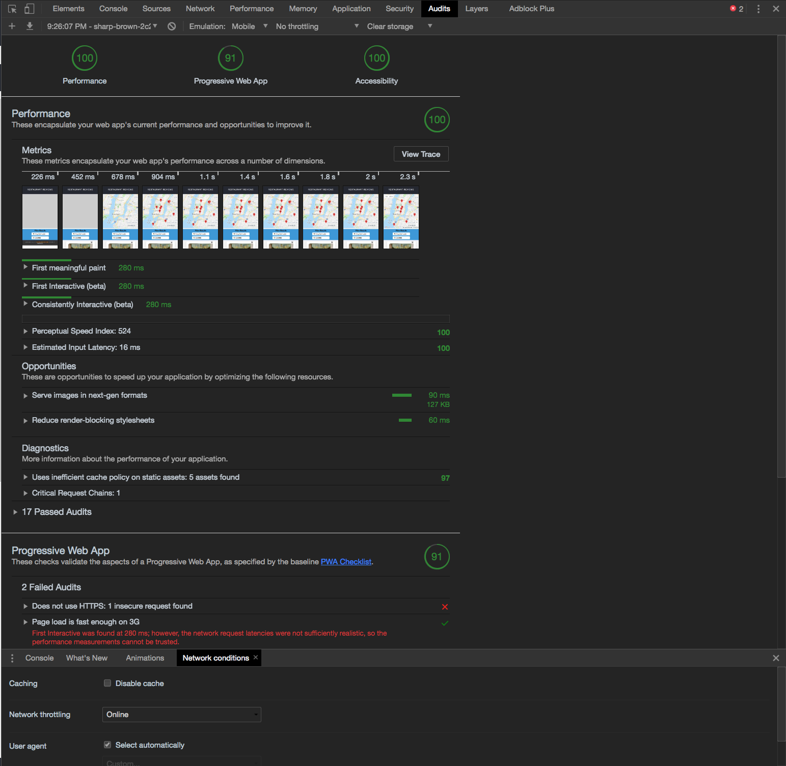

# Mobile Web Specialist Nanodegree Certification

---

This repo includes the completed tasks for stage one, two and three of the Udacity Mobile Web Specialist Restaurant Reviews nanodegree project.

### I have a live demo of the project on netlify which can be viewed [here](https://sharp-brown-2c2431.netlify.com/). I have cloned the development server to Glitch.com to work with the demo.

#### The API server used for this project can be found [here](https://github.com/udacity/mws-restaurant-stage-3)

#### If you want to run the project locally, clone the project repo, server API repo and install the dependencies.

> `$ git clone https://github.com/bvasilop/mws-restaurant-stage-3-final`

> `$ cd mws-restaurant-stage-3-final`

> `$ npm install`

#### \* If map is not loading properly, be sure to clear all caches and hard reload for service worker to update. (In Chrome right click refresh -empty cache and hard reload)

#### \* If testing for offline capabilities, click Applications tab in Chrome dev tools inspector, then click Service Worker and select the offline button.

#### Click refresh and app works offline with cached resources from serviceworker, IndexedDB and localhost

